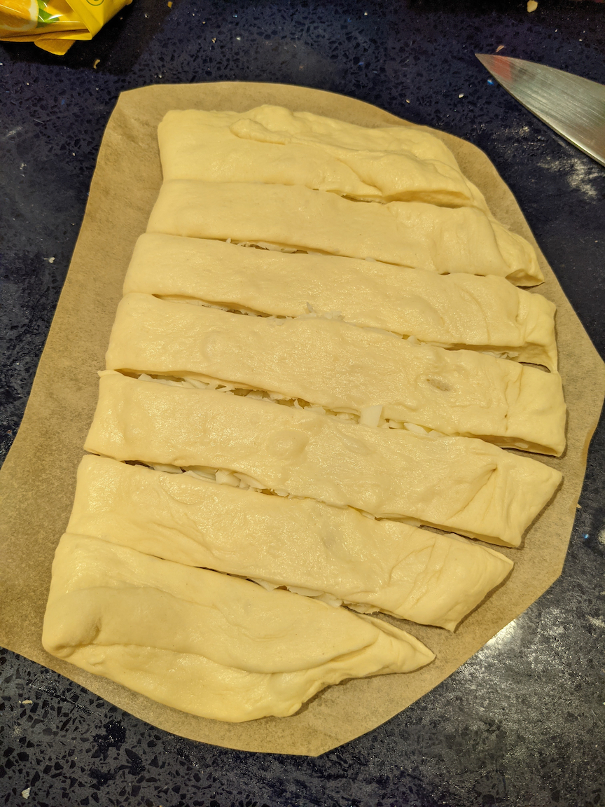

I've been making a lot more pizza during the pandemic, but one thing I wasn't able to replicate as well as take-out was some kind of garlic-and-cheesy breadstick.
After reading pizza-making forums and Reddit, and watching YouTube videos, I think I made a good replication for "Cheesy Bread".

## Ingredients

- 1 pizza dough ball, ~280 g [^1]
- 4 oz Mozzarella Cheese (I use "Rustic Cut")
- 1 oz Cheddar Cheese (I cube/crumble it roughly)
- Garlic oil (I use [this](https://enzostable.com/products/enzo-organic-extra-virgin-olive-oil-garlic-infused), but there are many options)

[^1]:
  You can definitely buy dough from a store (I like the dough they sell at [Arizmendi Bakery](https://www.arizmendibakery.com/)). Be sure to weigh it, though - e.g. the dough from Arizmendi is twice the size you want for a single cheesy bread, so you'll need to cut it in half and re-shape into two balls. If you buy dough from a store, still let it rest on the counter for ~2 hours.

  If you're making your own dough, here's my go-to recipe for pizza dough. This is inspired by recipes from [The Elements of Pizza](https://kensartisan.com/elements-of-pizza/) and [baking steel](https://bakingsteel.com/blogs/news/72-hour-pizza-dough-a-cold-version). This makes 3 balls of dough.

    - A few days before you need it:
        - Mix 500g bread flour, 350g water, 13g salt, 1.5g yeast (3/4 of 1/2 tsp), 10g sugar, until just combined
        - Knead (with wet hands) for 2 minutes, to remove clumps. Form a loose ball, and cover the container
        - Put in fridge 24-48 hours, but can go longer
    - 2 hours before before baking: 
        - Split to three portions of dough (~280g each)
        - Dust both sides of dough with flour, and form a dough ball. I use this [technique](https://bakingsteel.com/blogs/news/how-to-make-simple-pizza-dough-balls-1)
        - Place each dough ball in a oiled bowl, cover, and let sit for ~2 hours before use

## Steps

Prepare your dough ball like you would make a pizza - probably taking it out of the fridge ~2 hours before you're ready to bake it.

Preheat your oven to 450 F.

First, make the cheesy bread:
- Lightly flour your counter
- Stretch the dough ball to a rectangle (twice the size of the target cheesy bread)
- Place on parchment paper.
- Cover with 3oz mozzarella cheese.
- Fold in half, and seal the edges.
- Trim your parchment paper to slightly larger than the cheesy bread.
- Use a large knife to cut into about 8 strips.

At this point, it should look like this picture:

Now, put the parchment paper in a carbon steel or cast iron skillet.
Cover with the remaining 1oz mozzarella, and 1oz cheddar cheese.

Bake at 450 F for about 15-20 minutes, until well browned at the top.

This picture is slightly underdone on the bottom - I crowded my oven with 3 pizzas, so it didn't quite cook evenly. A few more minutes would have be ideal.

After taking out of the oven, drizzle with garlic oil on top.

Eat immediately, and serve with pizza sauce[^4].

[^4]: My pizza sauce recipe is pretty straightforward. Take a 28oz can of whole tomatoes, drain some of the liquid, add 1tsp salt and 2tsp sugar. Use an immersion blender to blend until it is just blended, then serve.
