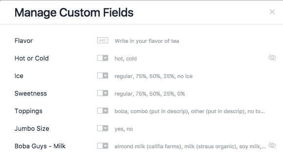
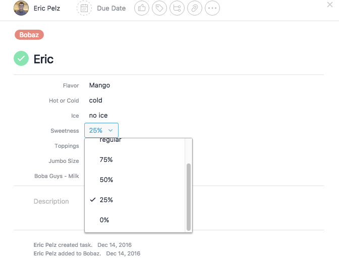
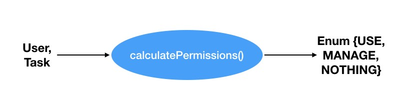
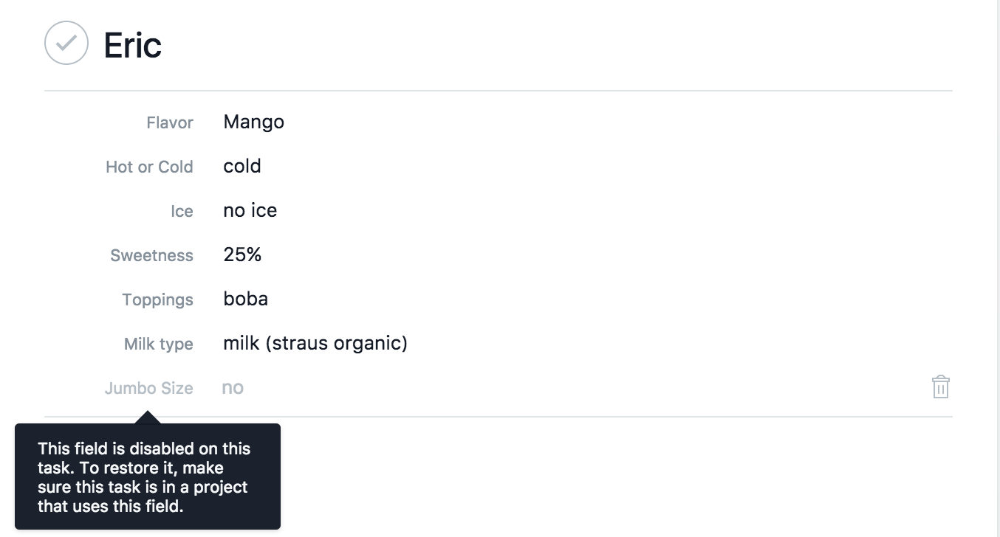

## Examples from building Custom Fields at Asana

Having simple code has a big impact on the velocity you can write code and how
enjoyable it is to do it. At Asana, one of our engineering values is to
[strive for simplicity](https://blog.asana.com/2016/05/asana-engineering-values/).
Most of the time, we talk about this in the context of
[engineering design](https://medium.com/building-asana/designing-simpler-react-components-13a0061afd16).
But simplicity is also a crucial guiding principle when making product
decisions.

Engineers often try to solve hard problems — and enjoy doing so. But it’s even
better to avoid the hard problem altogether. Last year, we released
[Custom Fields](https://blog.asana.com/2016/09/track-anything-with-custom-fields/),
a powerful feature that integrated across Asana. As a result, it had the
potential to introduce new or magnify existing complexity. Rather than choosing
the least complex engineering decision available, we strived to avoid the
complexity entirely.

In this post, we’ll talk about a few examples from Custom Fields where product
complexity influenced engineering. For each case, we sought to circumvent
complexity, and came up with a few learnings.

### What are Custom Fields?

First, a little background on Custom Fields. One of our first internal use cases
was group boba tea ordering. We have an Asana project which we use when we order
Boba as a group, where anyone can create a task for their drink order.

To have this working, first you need to create Custom Fields. In this case,
we’ve created a bunch of fields around a tea order: flavor, drink temperature,
sweetness level, and so on.

With that set up, this project now works like an order form. The project is set
up with Custom Fields to be compatible with a desired workflow. Projects can
have multiple Custom Fields and fields can be shared across projects. These
Custom Fields act like native Asana fields and work throughout the application.

### Restrain existing product complexity

Custom Fields is a premium feature, which means we had to gate the feature
behind premium checks. We ended up spending about 9 engineer weeks to gate the
feature to premium in the time leading to our launch.

The root issue here is that our data model has a lot of variations and Custom
Fields has a lot of touch points. Due to some historic reasons I won’t dive into
in this post, we have to check many aspects of the data model to determine if a
user can use Custom Fields. The ideal outcome would be to simplify the premium
model itself, but that wasn’t tractable given our launch plan and other ongoing
projects.

#### Our Solution: Buffer the complexity with a module

|                                                                      |
| :-------------------------------------------------------------------------------------------------: |
| _Pure functions like calculatePermissions can buffer old data model complexity into a simple enum._ |

We distilled the possible states into an enum, and then built pure helper
functions to handle the thorns in the data model. This meant that our
application code only needed to know the state of one enum. This buffered the
complexity resulting from the data model into one module, rather than everywhere
in the product.

#### Lesson: If complexity exists, constrain it to one place

If complexity already exists in the data model or app code, constrain it to one
place rather than having it extend to all touch points of your new feature. If
the API buffering this complexity is strong, then usages only need to concern
themselves with one concept, rather than many.

#### Lesson: Be sure the product is intuitive from the onset

Existing product complexity is hard to remove, especially when ingrained in the
data model. Future changes need to cope with the complexity and create
workarounds or abstractions around it.

Be sure the product and data model is intuitive and understandable from the
onset to avoid complexity. If you’re pushing towards a launch and want to be
scrappy, step back and think about how the code will end up over the next year.

Note: Since then, our Monetization Team simplified and standardized premium
checks moving forward!

### Reduce surface area

What if a task moves to a different project?

Custom fields must be on a project before any tasks can use them. If a user
moves a task to a different project, then it no longer inherits those Custom
Fields.

What do we do with the data already on those tasks?

#### Initial Plan: Incorporate Custom Fields in all project actions

|                                                                                                        |
| :-----------------------------------------------------------------------------------------------------------------------------: |
| _An interstitial dialog to warn the user about custom field ramifications from their action, part of the initial product spec._ |

The initial product spec was to clear values from tasks if they no longer have
fields bestowed onto them. Since this is a destructive action, we would prompt
the user and explain what is happening.

In the product, there are many ways to trigger this state: moving tasks between
projects, access control changes, and more. We would need to add this warning
throughout the entire product for each of these cases, including mobile and the
API! Additionally, removing custom field values on every task is a
nearly-unbounded amount of work for database and search indexing.

So we decided to take a step back and think. With the product manager and
designer, we went back to the original goals and motivations. The root cause
here is that the action the user is trying to take — removing projects or
changing project permissions — isn’t related to Custom Fields. They might not
even know what a Custom Field is! What if we could divorce the concept of custom
field values from project actions? Not only does this align with the user’s
mental model, but it is simpler.

#### Our Solution: Divorce custom field values from project actions

|                                                                                         |
| :-----------------------------------------------------------------------------------------------------------------: |
| _“Orphaned” custom fields are disabled in the UI, and no longer conferred to new tasks. Existing data is retained._ |

So we did just that. When you “orphan” a custom field on a task, we disable it
in the UI. The data is still there and we have a helpful message explaining why
the field is disabled, how to restore the old behavior, and how to clear out the
data.

#### Lesson: Reduce number of concepts code is aware of

Why is this better?

We took the initial scope of this change — throughout the entire application and
having stability concerns — and moved it to a single component. Other actions,
like adjusting project permissions, do not need to know about Custom Fields or
subtleties in its data model.

This removed the need for complexity, so we didn’t have to think up any clever
solution or algorithm. Instead, we adjusted render behavior in one place.

#### Lesson: Complexity is a barometer for how risky something will be

The incentive structure worked in our favor: our solution was faster and easier
to build. This is because more “thorns” in the product plan likely mean more
roadblocks or edge-cases to consider.

So treat complexity as a barometer for how risky something will be.

### Protect users from costly changes

Let’s talk about one more example from building Custom Fields.

Custom Fields are shared across projects, and are editable.What happens if you
edit a custom field dropdown and remove an option after others have used it?

When we discussed this on our team, we had similar trade-offs as with orphaned
values. One option was to clear out data on all tasks that used the custom field
and pretend the option never existed.

#### Our Solution: Reduce propagation of changes from a single action

|                                                                                                |
| :------------------------------------------------------------------------------------------------------------------------: |
| _Archived dropdown options are annotated in the UI, and existing data is retained. New tasks cannot use archived options._ |

Instead, we went back to the product goals and came up with an alternative
solution: to strikethrough archived options and not let new values be set to it.
In other words, keep the data on existing tasks, and exclude it from new entry
points. If you re-create an option with the same name, we resurrect the old
option and its values.

#### Lesson: Protect users from unbounded work

The initial solution of iterating on every task would have caused an unbounded
amount of work, presenting a stability concern.

Further, this would have been a slow and asynchronous action. On the product
side, we would need to support an intermediate in-progress state wherever we
showed Custom Fields. This would have spread the complexity throughout the app
and added even more work.

#### Lesson: Protect users from sharp edges

The initial implementation might also have led to some unhappy users. Since
Custom Fields are shared across a domain, editing dropdown fields would lead to
perceived data loss for other users of those fields. If two teams use the same
custom field, and one makes a change, then the other team would be surprised to
see their data vanish!

As a result, we would have needed to build on to this — adding undo support,
notifications on what happened, or other tweaks. So our solution also led to
less complexity and surface area down the road.

### Conclusion

These are a few examples of ways we thought about complexity when building
Custom Fields. A couple of small product considerations and tweaks led to a huge
impact on implementation time and simplicity. Our key takeaway is that when
you’re working on product features, it’s often best to consider ways to
circumvent the complexity, rather than adapting to it.

---

_Originally published at
[blog.asana.com](https://blog.asana.com/2017/09/circumventing-engineering-complexity-examples-from-asana/)
on September 11, 2017._
