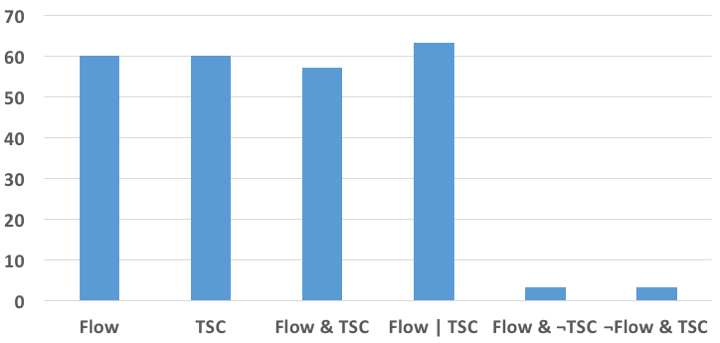
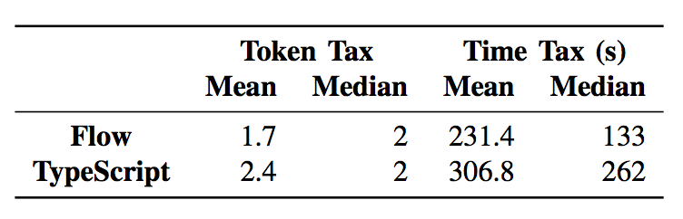

It's extremely common for engineering teams to debate the value of static versus
dynamic typing systems. The last few years has seen a big rise in TypeScript and
Flow usage, which add static type checking to JavaScript.

Within an individual engineering team, it's fairly difficult to determine the
actual value that one attains from switching from a dynamic to static typing
system.

A group of researchers created a study to look into just this: do static type
systems improve software quality, and if so, by how much?

This post summarizes the research published in
[To Type or Not to Type: Quantifying Detectable Bugs in JavaScript](http://ttendency.cs.ucl.ac.uk/projects/type_study/documents/type_study.pdf),
by Gao et. al. IEEE 2017, with particular attention on aspects of the paper
applicable to software engineering teams using JavaScript or its typed variants.

Result: 15% of sampled JavaScript bugs were detectable by Flow 0.30 and
TypeScript 2.0.

## Definition and methodology

The research team classified a bug as `ts-detectable`[^1] if using type
annotations would cause an error on a line changed by a bug fix, and when the
new type annotations are consistent with the fixed program.

[^1]:

  > Definition for `ts-detectable`: Given a static type system `ts`, a bug `b`
  > is `ts-detectable` when adding or changing type annotations causes the
  > program `p` containing `b` to error on a line changed by a fix and the new
  > annotations are consistent with `f`, a fixed version of `p`.

At the time of analysis (08/19/2015), there were 3,910,969 closed bug reports on
open-source JavaScript projects on GitHub. The authors wanted a 95% confidence
level, and so sampled 400 bugs at random for the experiment.

The researchers classified each bug as `ts-detectable` in each of TypeScript 2.0
and Flow 0.30. First, they checked if the bug report was absolutely not
type-related (for example, if the bug was due to a misunderstanding of the
product specification), and if so they labeled it as undetectable. Next, they
looked at the intended behavior of the bug fix and attempted to add type
annotations to cause the type system to error at the area of code patched by the
bug fix. If they could do this, the sample was deemed `ts-detectable`; otherwise
it was not. The researchers also set a time-bound for each bug investigation to
10 minutes, after which the bug was deemed unknown.

## Results



The team was able to label all 400 bug samples: Each of Flow and TypeScript
detected 60 of the bugs. This means at the confidence level of 95%, the
percentage of detectable bugs for each falls into [11.5%, 18.5%] with mean 15%.

Most of the bugs were easy to determine: only 18 of the 400 hit the time-box
period of 10 minutes, mostly due to external modules and interfaces making it
harder to isolate the source of the bug with type annotations. The team spent
more time on these bugs, utilizing published type definitions and documentation
when necessary, and were able to classify them all.

### Caveats

The authors think this greatly understates the impact of static typing, because:

- They only surveyed publicly visible bugs, which means any bug caught during
  development was not included. They also think public bugs are more often cause
  by misunderstanding of the specification, which type systems cannot detect.
- These results do not include any other strengths of static type systems, like
  developer efficiency or app performance.
- This experiment uses the relatively weak type systems of TypeScript and Flow.
- The authors have limited expertise in Flow and TypeScript, which means they
  could have incorrectly deemed bug as undetectable.

### What about the undetectable bugs?


The vast majority of bugs that were undetectable were due to "specification
errors", which constituted 78% of total bugs. This is covered by `BranchError`,
`PredError`, `UIError`, and the catch-all `SpecError` in the above histogram.
This demonstrates the importance of careful specification before development
begins.

The second most common error type was `StringError`, often due to a wrong URL.

### Comparing TypeScript and Flow

While TypeScript and Flow had the same number of `ts-detectable` bugs, they
don't have complete overlap. There were 3 bugs that were only detectable on
Flow, and 3 only on TypeScript.

In all of the three bugs detectable in Flow but not TypeScript, the bug was a
result of concatening a possible undefined or null value with another string.
For example:

```javascript
var x = " " + null + " ";
```

This highlights a TypeScript weakness, at least as of version 2.0, in its null
handling.

Two of the three bugs detectable in TypeScript but not Flow were due to Flow's
incomplete support for using string literals as an index.

Also of note: of the 60 ts-detectable bugs, 22 of them needed null checks. This
is a feature added in TypeScript 2.0, and needs `--strictNullChecks` enabled.

## Approximating the cost of using static typings

While it's incredibly difficult to directly measure the effort for programmers
to use a static type system, the authors tried to approximate this.

They defined:

- A `token tax`, which was the number of tokens in an annotation needed to
  trigger a type error for the bug in question. The goal for this was to proxy
  the number of decisions a programmer would take when adding type annotations.
- A `time tax`, which was the time spent adding annotations.

Note that these measures are an underestimate of the real-world cost, because
they are calculated for a single bug in which the authors only used type
annotation to target the bug in question (and not the entire module).

These metrics are only intended to track the incremental cost for each change a
developer makes. If we assume an entire project is already using a static type
checker, then the cost to a developer is only the time and tokens needed as part
of their code change.



Using these measures, the authors find that the mean annotation tax for each bug
is: 1.7 tokens and 231 seconds for Flow, and 2.4 tokens and 306 seconds for
TypeScript.

The authors note this discrepency is largely due to Flow's paradigm of strong
type inference, and a more compact syntax for nullable types, which made it
faster for them to annotate.

However, the authors also noted that the most time-consuming aspect of this
project was handling external modules and their typings. For many projects, Flow
didn't have built-in support, and the team leaned on the TypeScript community's
[set of type definitions](https://github.com/DefinitelyTyped/DefinitelyTyped).

## Takeaways

The research is pretty clear that static typing _does_ indeed help prevent a
significant percentage of bugs, even for engineers not familiar with the
language or codebase.

While it's possible those bugs could have been caught through other means --
such as testing or linting -- there's a huge benefit in preventing this class of
issues as part of your development cycle (as opposed to your testing process).
There are also many other adjacent benefits of static typing that were not
explored in this research, such as improved code editor integration and faster
new engineer onboarding to a codebase.

One takeaway from this research is that there is value in an incremental
conversion of your codebase to static typing. The researchers did not convert
entire projects and were still able to prevent bugs. Rather than hold off
conversion until your team has bandwidth to fully migrate, start incrementally
with the most commonly edited files or those most susceptible to bugs.

TypeScript and Flow performed similarly in the goal of preventing bugs, but may
have more significant differences in adoption in a company or toolkit. Use the
software that most fits your team's needs and goals: the differences highlighted
here are negligable enough.
